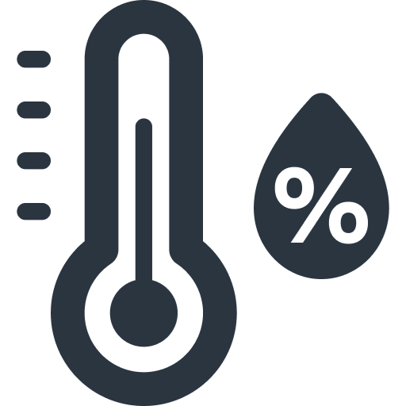

# Sencrop

## Sencrop {background-opacity=0.25 background-image="raincrop.jpg"}

35000 stations météorolgiques réparties sur toute l'Europe

```{=html}
<table>
  <tr>
    <td></td>
    <td style="vertical-align: middle">température de l'air & hygrométrie</td>
  </tr>
  <tr>
    <td></td>
    <td style="vertical-align: middle">direction et vitesse du vent</td>
  </tr>
    <tr>
    <td></td>
    <td style="vertical-align: middle">pluviométrie</td>
  </tr>
  <tr>
    <td></td>
    <td style="vertical-align: middle">point de rosée</td>
  </tr>
</table>
```

## Spatialisation 

Est-ce que l'on peut fournir de la donnée météorologique de qualité sur n'importe quel localisation sur le territoire ?

- comparaison des mesures de stations avec les médianes sur les grilles `h3`


# kedro en quelques mots

## kedro en quelques mots

- librairie de transformations de données
  - découplage entre les sources de données et les transformations opérées
- trois concepts principaux
  - node : fonction — au sens Python — avec un/des `dataset` d'entrée et un/des `dataset` de sortie
  - pipeline : Direct Acyclic Graph composé de `node`
  - catalog : un ensemble de `dataset`
- structure rigide
  - facile d'entrer sur un projet

## nodes & pipelines

:::: {.columns}

:::{.column}
```{.python filename="src/pipelines/weather_conditions/pipeline.py"}
from kedro.pipeline import Pipeline, node, pipeline

from .nodes import create_model_input_table, preprocess_companies, preprocess_shuttles


def create_pipeline(**kwargs) -> Pipeline:
    return pipeline(
        [
            node(
                func=preprocess_companies,
                inputs="companies",
                outputs="preprocessed_companies",
                name="preprocess_companies_node",
            ),
            ...
            node(
                func=create_model_input_table,
                inputs=["preprocessed_shuttles", "preprocessed_companies", "reviews"],
                outputs="model_input_table",
                name="create_model_input_table_node",
            ),
        ]
    )
```
:::

:::{.column}
```{.python filename="src/pipelines/weather_conditions/nodes.py"}
import pandas as pd

...

def preprocess_companies(companies: pd.DataFrame) -> pd.DataFrame:
    """Preprocesses the data for companies.

    Args:
        companies: Raw data.
    Returns:
        Preprocessed data, with `company_rating` converted to a float and
        `iata_approved` converted to boolean.
    """
    companies["iata_approved"] = _is_true(companies["iata_approved"])
    companies["company_rating"] = _parse_percentage(companies["company_rating"])
    return companies
```
:::
::::
## catalog et environment

- catalog : définition des `dataset` d'entrée et de sortie
- environnement : ensemble du catalog et d'un jeu de paramètres

:::{.r-stack}
:::{.fragment .fade-in-then-out}
```{.yaml filename=/conf/base/catalog.yaml width="200px"}
companies:
  type: pandas.CSVDataset
  filepath: data/01_raw/companies.csv

preprocessed_companies:
  type: pandas.ParquetDataset
  filepath: data/02_intermediate/preprocessed_companies.pq
```

---

```sh
kedro run --pipeline my_pipeline --env base
```
:::

:::{.fragment .fade-in}
```{.yaml filename=/conf/test-local/catalog.yaml }
companies:
  type: pandas.CSVDataset
  filepath: data/01_raw/companies.csv

preprocessed_companies:
  type: pandas.CSVDataset
  filepath: data/02_intermediate/preprocessed_companies.csv
```

---

```sh
kedro run --pipeline my_pipeline --env test-local
```
:::
:::

## structure

```bash
.
├── conf
│   ├── base
│   │   ├── catalog.yml
│   │   └── parameters.yml
│   └── local
│       └── credentials.yml
├── data
│   ├── 01_raw
│   └── ...
├── notebooks
└── src
    └── my_project
        ├── pipeline_registry.py
        └── pipelines
            └── my_pipeline
                ├── nodes.py
                └── pipeline.py
```

# kedro: du développement à la production


## Dumas du tuyau : trois écrivains et un lecteur

## sources: SQL & API

## Des tests à la production : une histoire de sources


:::: {.columns}

:::{.column}
```{.yaml filename="/conf/test-measures/catalog.yml"}
locations:
  type: pandas.JSONDataset
  filepath: data/01_raw/test_measures/locations.json

formatted_measures_on_grids:
  type: pandas.CSVDataset
  filepath: data/03_primary/test_measures/measures_on_grids.csv
  load_args:
    parse_dates:
      - timestamp
```
:::
:::{.column}
```{.yaml filename="/conf/production/catalog.yml"}
locations:
  type: pandas.JSONDataset
  filepath: s3://virtual-stations/virtual-stations.json

formatted_measures_on_grids:
  type: datasets.ConfluentKafkaAvroDataset
  save_args:
    topic: h3_cells_time_series
    cluster:
      bootstrap_servers: ...
    schema_registry:
      url: ...
    schema:
      name: h3_cells_time_series
      type: record
      fields:
        - name: h3_cell_id
          type: string
        - name: h3_cell_resolution
          type: int
        ...
```
:::
:::

# Conclusion

retour d'expérience : PoC to production in a few weeks
structure rigide = expérience de développement excellente
limites: databricks, spark/pandas -> Ibis/ORM/Narwhal
communauté: Slack

custom datasets

discuter production : airflow scheduler, Docker